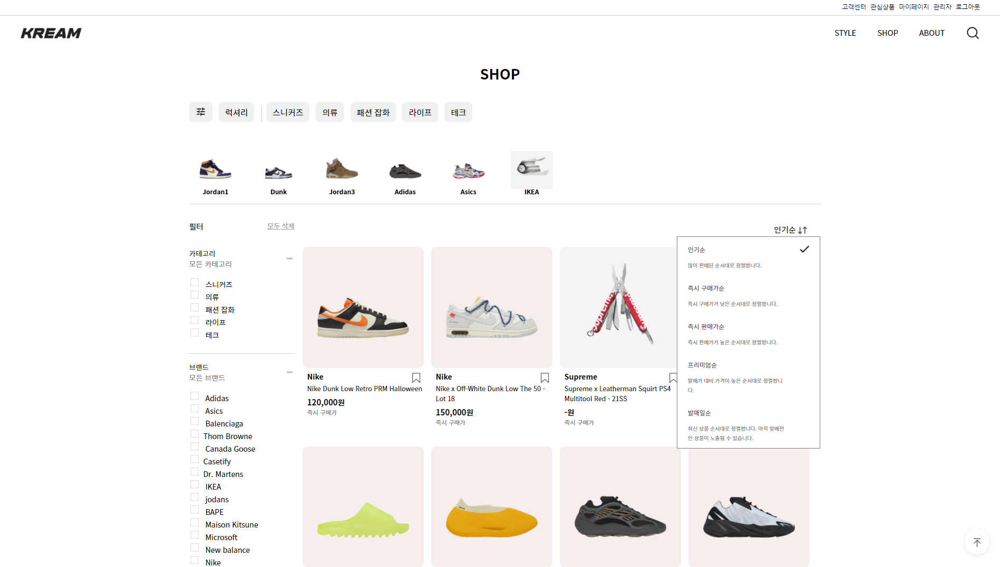
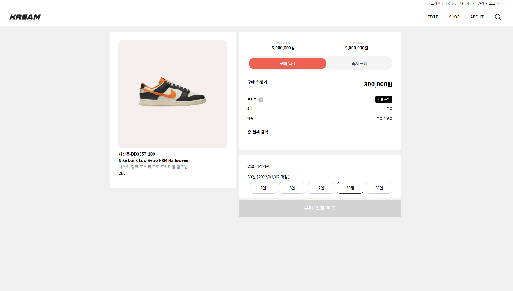

# KREAM 사이트 클론코딩 / Spring-Boot, Oracle
 * 개발 기간 : 2021.07.30 ~ 2021.10.31
 * 주제 : 한정판 리셀(KREAM)
 * 개발 : IntelliJ, Oracle , Visual Studio code
 * 사용 언어 : Java(JDK), Oracle SQL, HTML5, CSS3, Javascript(ES6)
 * 사용 기술 : JDBC,Thymeleaf,jQuery,Ajax,Spring-Boot(2.5),Mail API,JPA/Hiberrate, Restful API, QueryDSL
  

## 리팩토링 완료 ##
### 수정 일자
- 2022년 01월 17일 수정
  - AddressService
  - CustomerService
  - ProductService
  - PurchaseService
  - StyleImgservice
  - TransactionService
  - WithdrawalService
  - DashBoardService
  - FollowService
  - HashTagService
  - ProductQnaService
- 2022년 01월 18일 수정
  - ProductService
  - ProImgservice
  - ProSizeService
  - ProductTagService
  - StyleService
- 2022년 01월 20일 수정
  - 나머지 Service 모두 수정 완료

## <b>프로젝트 상세내용</b> ##
### <b>구현목표</b> ###
> 사용자 페이지
1. 입찰 시스템 구현(구매입찰/판매입찰)
2. 상품별 최근/평균 가격 구현
3. SNS와 같은 게시물 등록/수정 기능 구현
4. 해당 게시물과 댓글에 좋아요/댓글/팔로우 기능 구현
5. 세분화된 필터(다중필터)

>관리자 페이지
1. 회원관리(전체회원/탈퇴회원/블랙리스트)
2. 배송현황 관리
3. 문의 및 공지사항 관리
4. 상품관리(상품 등록/수정 및 게시상태)
  

## <b> 담당한 기능(Front-End) </b> ##
- HTML/CSS/JS 사용자 part 마이페이지, 스타일, 게시판, 서비스 소개 담당
- axios를 이용하여 관리자 메인 페이지 데이터 삽입
- 사용자 페이지 공지사항, style 해시 태그별 관련 데이터 조회
  

## <b> 어려웠던 부분 </b> ##
- 각자 개인이 맡은 파트별 파일 저장명, 이미지 폴더 저장명이 달라 중간에 폴더를 합치는 과정에서 시간이 오래 걸렸습니다. 
  인원이 많다보니 한명씩 돌아가며 기본 파일을 두고 파일을 저장하는 과정에서 파일이 삭제되는 경우도 발생하게 되었습니다.
  이러한 경험을 바탕으로 다음 프로젝트 때는 폴더 저장명, 이미지 경로, github 이용을 통해 조금 더 나은 개발환경에 대해 깨닫게 되었습니다.
  

## <b> 성장한 부분 </b> ##
- 팀원들 간 커뮤니케이션이 중요하다는 것과 Web server Architecture에 대해 이해할 수 있게 되었습니다.
- 개발자 입장에선 서비스가 완성되었지만, 사용자 입장에서는 많이 부족할때가 많다는 것을 알게 되었습니다.
  FE 측면에서 완성도를 높이기 위해선 클릭/효과 등 UX에 집중해야 하는 것을 깨달았습니다.
  

## <b> 보완할 점 </b> ##
- 데이터가 많을 수록 데이터를 불러오는 속도가 느려져 AWS를 이용하여 사용자가 빠르고 편리하게 이용할 수 있도록 보완할 예정입니다.
  

## <b> ERD </b> ##

  

## <b>시연 영상</b> ##

## <b>구동 화면</b> ##
> 사용자 페이지
* 메인(/)

  
* 로그인(/login)

  
* 상품(/search)

  
* 입찰 시스템(/product/상품번호, /kream/buying/상품번호/사이즈)

  
* 스타일(/social/trending)
 
  
* 스타일 게시물 클릭시 보여지는 페이지(./img/popular)

  
  

> 관리자 페이지
* 대시보드(/pages)
 
* 주문(/pages/order/search)
 
* 상품등록(/pages/product/check)

* 공지사항(/pages/content/manage)

* 회원관리(/pages/member/all)

  

